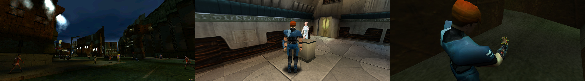

## Omikron: The Nomad Soul widescreen and wider

Experience the first Quantic Dream game in proper widescreen for the first time since 1999. No more stretching or field of view reduction at 16:9 or wider.

#### Forcing the game to support modern resolutions
1. Download [dgVoodoo 2](https://github.com/dege-diosg/dgVoodoo2/releases).
2. Copy D3DImm.dll and DDraw.dll from \MS\x86\ of the archive to the game folder (next to the Runtime file).
* As an option, also copy dgVoodooCpl.exe and dgVoodoo.conf from the archive and run the exe to remove the dgVoodoo watermark or configure the visuals (e.g. disabling mipmapping under DirectX will make the game textures look sharper).

#### Enabling the widescreen fix
1. [Download](/../../releases) and unpack the fix archive offered here.
2. Launch the game and the tool.
3. Press the hotkey as displayed to toggle the fix in real time.

#### Notes
All trainers based on CE components may trigger some anti-virus software.

Tested on the latest Steam version at 2560x1080, 3440x1440, 3840x1080, 5760x1080 and 11520x1080. The UI spans, making it undesirable for triple monitor setups.

You can buy me a [coffee](https://ko-fi.com/rozziroxx) or become a [patron](https://www.patreon.com/rozzi).

